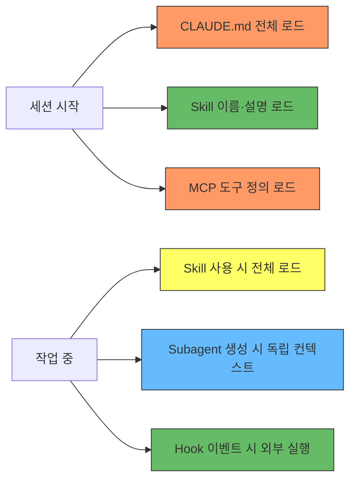

# 컨텍스트 비용 이해하기

> **한눈에 보기**
> CLAUDE.md와 MCP는 매 요청마다 컨텍스트를 소비한다. Skills는 사용 전까지 거의 비용이 없다. Subagents는 메인 컨텍스트에 영향을 주지 않는다. Hooks는 비용 제로다. 기능을 추가할수록 컨텍스트가 채워지고, 노이즈가 늘어나 Claude의 판단 정확도가 떨어질 수 있다.

## 왜 컨텍스트 비용을 신경 써야 하는가

Claude Code의 컨텍스트 윈도우는 유한하다. 확장 기능을 추가할 때마다 컨텍스트의 일부를 차지한다. 문제는 단순히 "공간이 부족해진다"가 아니다. 컨텍스트에 불필요한 정보가 많아지면:

- Skills가 올바르게 트리거되지 않을 수 있다
- Claude가 프로젝트 컨벤션을 놓칠 수 있다
- 전반적인 응답 품질이 저하될 수 있다

따라서 각 기능이 컨텍스트에 미치는 영향을 이해하고, 필요한 것만 활성화하는 것이 중요하다.

---

## 기능별 컨텍스트 비용

| 기능 | 로딩 시점 | 로딩되는 내용 | 비용 패턴 |
|------|----------|-------------|----------|
| **CLAUDE.md** | 세션 시작 | 전체 내용 | 매 요청마다 소비 |
| **Skills** | 세션 시작 + 사용 시 | 시작 시: 이름·설명만 / 사용 시: 전체 내용 | 사용 전까지 낮음 |
| **MCP 서버** | 세션 시작 | 모든 도구 정의와 JSON 스키마 | 매 요청마다 소비 |
| **Subagents** | 생성 시 | 독립 컨텍스트에 로드 | 메인 세션과 격리 |
| **Hooks** | 이벤트 발생 시 | 없음 (외부 스크립트로 실행) | 제로 (출력 반환 시 제외) |

---

## 기능별 로딩 상세

### CLAUDE.md

세션 시작 시 전체 내용이 로드된다. 관리 정책(managed), 사용자(user), 프로젝트(project) 수준의 모든 CLAUDE.md 파일이 합산된다. 작업 디렉토리에서 루트까지의 파일이 시작 시 로드되고, 하위 디렉토리의 파일은 해당 디렉토리의 파일에 접근할 때 추가 로드된다.

**최적화:** 500줄 이하로 유지한다. 참고 자료는 Skills로 옮겨 필요할 때만 로드되게 한다.

### Skills

세션 시작 시에는 이름과 설명만 로드된다 (Claude가 어떤 Skill이 있는지 파악하기 위해). 실제 사용 시 전체 내용이 로드된다.

`disable-model-invocation: true`를 frontmatter에 설정하면 Claude에게 완전히 숨길 수 있다. 이 경우 사용자가 직접 호출(`/이름`)하기 전까지 컨텍스트 비용이 제로다.

Subagent 내에서는 다르게 작동한다. Subagent에 전달된 Skills는 생성 시 전체가 미리 로드된다. 메인 세션의 Skills를 상속하지 않으므로, 필요한 것만 명시적으로 지정해야 한다.

**최적화:** 부작용이 있는(side effect) Skill에는 `disable-model-invocation: true`를 설정한다. 컨텍스트를 절약하고, 의도치 않은 실행도 방지한다.

### MCP 서버

세션 시작 시 연결된 모든 서버의 도구 정의와 JSON 스키마가 로드된다. Tool Search 기능(기본 활성화)이 컨텍스트의 10%까지 MCP 도구를 로드하고, 나머지는 필요할 때 지연 로드한다.

**최적화:** `/mcp` 명령으로 서버별 토큰 비용을 확인한다. 현재 사용하지 않는 서버는 연결을 해제한다.

### Subagents

메인 세션과 격리된 독립 컨텍스트에서 작동한다. 로드되는 내용:

- 시스템 프롬프트 (캐시 효율을 위해 부모와 공유)
- 지정된 Skills의 전체 내용
- CLAUDE.md와 git 상태 (부모에서 상속)
- 메인 에이전트가 프롬프트에 전달한 내용

메인 세션의 대화 기록이나 활성화된 Skills는 상속되지 않는다.

**최적화:** 메인 대화의 컨텍스트가 가득 차거나, 중간 작업 과정이 보일 필요가 없을 때 Subagent를 활용한다.

### Hooks

이벤트 발생 시 외부 스크립트로 실행된다. 기본적으로 컨텍스트에 아무것도 로드하지 않는다. Hook이 출력을 반환하는 경우에만 해당 출력이 대화에 추가된다.

**최적화:** 린트, 로깅 같은 부작용 작업에 이상적이다. Claude의 컨텍스트에 영향을 주지 않으면서 자동화를 수행할 수 있다.

---

## 로딩 흐름 요약

- 빨간색: 매 요청마다 비용 발생
- 노란색: 사용 시 비용 발생
- 초록색: 비용 낮음 또는 제로
- 파란색: 메인 세션과 격리
